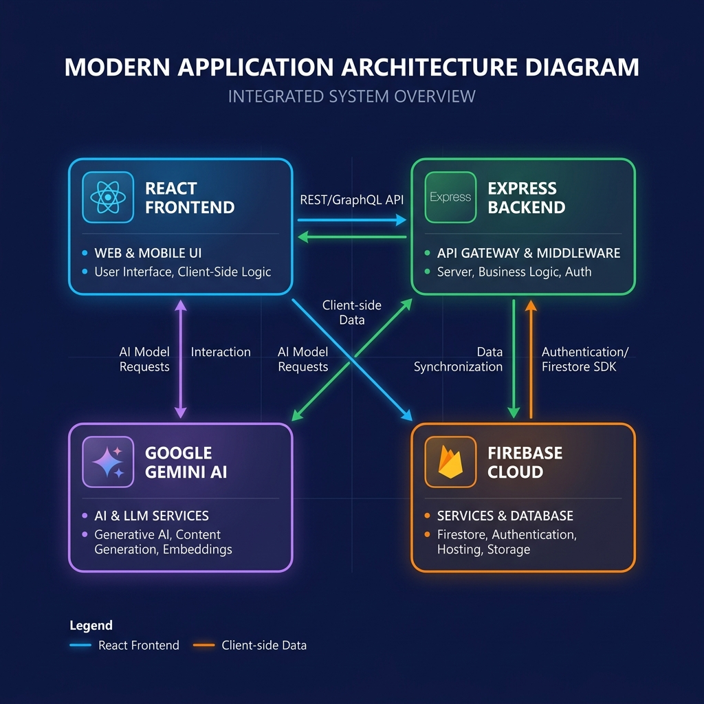

<h1 align="center">
  <a href="https://kushalradia.github.io/studyosanimation/" target="_blank">
    
    <br/><br/>
    
  </a>
</h1>
  
  <p align="center">
    <strong>A cognitive-first, AI-powered study cockpit — built around how the human brain actually learns.</strong>
  </p>
  
  <p align="center">
    <a href="https://studyos-fn6m.onrender.com"></a>
    &nbsp;
  </p>
  
  <p align="center">
    
    
    
    
    
    
    
    
  </p>
  
  ---
  
  ## 📌 What is StudyOS?
  
  **StudyOS** is a unified AI study platform equipped with **12 specialized cognitive engines**, live collaboration hubs, a real-time mistake diagnostic suite, and an emergency exam protocol — all powered by **Google Gemini 2.5** and **Firebase**.
  
  Unlike generic AI tutors that just answer questions, StudyOS is engineered around the **science of learning** — active retrieval, spaced repetition, Socratic questioning, and reverse deadline planning. Every tool targets a specific moment in the study cycle.
  <br/>
  
  ---
  
  ## ⚡ Feature Highlights
  
  <table>
    <tr>
      <td>🧠 <b>12 AI Study Tools</b></td>
      <td>Each tool is purpose-built for a specific learning phase</td>
    </tr>
    <tr>
      <td>🚨 <b>Panic Mode</b></td>
      <td>Emergency protocol for exams in 1–24 hours</td>
    </tr>
    <tr>
      <td>🧬 <b>Study DNA</b></td>
      <td>AI-decoded learning archetype from your usage data</td>
    </tr>
    <tr>
      <td>🃏 <b>SM-2 Flashcards</b></td>
      <td>Spaced repetition with Knowledge Health dashboard</td>
    </tr>
    <tr>
      <td>🤝 <b>Collab Hub</b></td>
      <td>Real-time study rooms with shared roadmaps & mind maps</td>
    </tr>
    <tr>
      <td>🌐 <b>10 Languages</b></td>
      <td>Hindi, Tamil, Telugu, Gujarati, Bengali, and more</td>
    </tr>
    <tr>
      <td>🎙️ <b>Voice Input</b></td>
      <td>Speak your topic — Web Speech API integrated everywhere</td>
    </tr>
    <tr>
      <td>📤 <b>Social Sharing</b></td>
      <td>Canvas-generated shareable image cards</td>
    </tr>
    <tr>
      <td>🔔 <b>Smart Reminders</b></td>
      <td>Browser notifications synced to your study plan</td>
    </tr>
    <tr>
      <td>🔥 <b>Streak Tracking</b></td>
      <td>Daily study streak computed from Firestore history</td>
    </tr>
  </table>
  
  ---
  
  ## 🛠️ The 12-Tool Arsenal
  
  StudyOS tools are organized into **four cognitive phases** — from diagnosis to deep recall:
  
  ### 🔬 Phase 1 · Diagnosis & Gap Analysis
  
  | Tool | What It Does |
  |---|---|
  | **🩺 WhyAmIWrong** (Diagnose) | Paste your wrong answer — the AI identifies the *exact conceptual root cause*, not just "you're wrong." Tracks error patterns over time. |
  | **🧠 TeachMeBack** (Tutor) | A Socratic AI that forces *you* to explain a concept. It challenges your logic over 5 rounds and gives you a mastery score (0–100). Never explains for you — only questions. |
  | **🔬 Exam Autopsy** | Upload a graded test. The AI performs a cognitive post-mortem — classifying each mistake as a comprehension gap, memory slip, careless error, or time pressure issue. |
  
  ### 📅 Phase 2 · Strategic Planning
  
  | Tool | What It Does |
  |---|---|
  | **📆 DeadlineReverse** (Planner) | Input your exam date + topics. The AI builds a *reverse-engineered* daily study roadmap, prioritizing weak areas and spacing revision optimally. Exports to browser notifications. |
  | **🧬 Study DNA** | Analyses your full usage history (tools used, time patterns, error types) to decode your unique learning archetype — *e.g., The Night Owl Scholar, The Last-Minute Sprinter*. |
  
  ### 💡 Phase 3 · Conceptual Mastery
  
  | Tool | What It Does |
  |---|---|
  | **⚡ 5-Minute Explainer** | Enter any topic + time limit. The AI returns a ruthlessly filtered breakdown: **Must Know** (essentials), **Good to Know** (context), and **Skip** (noise). |
  | **🗺️ Concept Linker** (Mapper) | Generates an interactive D3.js-powered knowledge graph showing how concepts connect in 2D space. Drag, zoom, and explore relationships. |
  | **📝 PYQ Solver** | Paste a past-year question from JEE, NEET, CA, GATE, etc. Get a step-by-step solution with the reasoning strategy explained at each stage. |
  | **📸 Snap & Solve** | Upload a photo of a handwritten equation, diagram, or text block. Multimodal Gemini decodes it and delivers an instant step-by-step solution. |
  
  ### 🧠 Phase 4 · Compression & Recall
  
  | Tool | What It Does |
  |---|---|
  | **🎧 Lecture Digest** | Paste a transcript, upload audio, or enter a topic. The AI compresses it into structured active-recall notes with key takeaways and summary. |
  | **✍️ Write Unblock** | Stuck writing an essay or solving a proof? Get *structural hints* (outline, framing, argument flow) without the AI doing the work for you. |
  | **🃏 Spaced Flashcards** | AI-generated flashcard decks with SM-2 spaced repetition scheduling. Includes a **Knowledge Health** dashboard showing memory decay curves per deck. |
  
  ---
  
  ## 🚨 Panic Mode — Emergency Protocol
  
  > *For students with an exam in just a few hours.*
  
  Enter your exam topic and remaining time. The platform instantly generates three panels:
  
  | Panel | What It Contains |
  |---|---|
  | **⏱️ Session Plan** | Hour-by-hour Pomodoro schedule — exactly what to study, when to break, when to review |
  | **🎯 Most Likely Questions** | 10 highest-probability questions ranked by likelihood (High / Medium) |
  | **📋 MVK Cheat Sheet** | Minimum Viable Knowledge — the absolute essential facts, formulas, and rules |
  
  The entire UI shifts to a dramatic full-screen dark theme with red accents to create focused urgency.
  
  ---
  
  ## 🤝 Collab Hub — Live Study Rooms
  
  Launch real-time collaboration rooms powered by **Firebase Firestore listeners**:
  
  - **📋 Collaborative Roadmaps** — Build a shared study checklist with task assignment and completion tracking
  - **🗺️ Connected Mind Maps** — Group-edited node networks mapping curriculum concepts together
  - **👥 Live Presence** — See who's active in the room in real-time
  - **🔗 Invite by Link** — Share a session ID to bring peers into your room
  
  ---
  
  ## 🏗️ Architecture
  
  <p align="center">
    
  </p>
  
  ```
  ┌─────────────────────────────────────────────────────────────────┐
  │                        CLIENT (React SPA)                       │
  │  React 19 · TypeScript · Vite 6 · TailwindCSS v4 · Motion       │
  │                                                                 │
  │  ┌──────────┐  ┌──────────┐  ┌──────────┐  ┌──────────────────┐ │
  │  │ Landing  │  │Dashboard │  │ 12 Tools │  │ Collab / History │ │
  │  │  Page    │  │  + Feed  │  │  Pages   │  │  + Flashcards    │ │
  │  └──────────┘  └──────────┘  └──────────┘  └──────────────────┘ │
  │          │              │             │               │         │
  │          └──────────────┴──────┬──────┴───────────────┘         │
  │                                │                                │
  │                    ┌───────────▼───────────┐                    │
  │                    │  geminiService.ts     │                    │
  │                    │  (Client API Layer)   │                    │
  │                    └───────────┬───────────┘                    │
  └────────────────────────────────┼────────────────────────────────┘
                                   │  HTTP POST
                                   │
  ┌────────────────────────────────▼────────────────────────────────┐
  │                    SERVER (Express.js)                          │
  │                                                                 │
  │   POST /api/gemini/generate      →  Single-shot generation      │
  │   POST /api/gemini/multimodal    →  Image + text (Snap & Solve) │
  │   POST /api/gemini/chat          →  Multi-turn (TeachMeBack)    │
  │                                                                 │
  │   ┌──────────────────────────────────────────────────────────┐  │
  │   │  @google/genai SDK  →  Gemini 2.5 Flash                  │  │
  │   │  (API key stays server-side, never exposed to client)    │  │
  │   └──────────────────────────────────────────────────────────┘  │
  └─────────────────────────────────────────────────────────────────┘
  
  ┌─────────────────────────────────────────────────────────────────┐
  │                    FIREBASE (Cloud Services)                    │
  │                                                                 │
  │   🔐 Authentication ──── Google Sign-In (OAuth 2.0)             │
  │   🗄️ Firestore ────────── 12+ collections with security rules   │
  │   📦 Storage ───────────── File uploads (future)                │
  │                                                                 │
  │   Collections: users · flashcards · history · collabSessions    │
  │   explainerHistory · teachSessions · studyPlansHistory · ...    │
  └─────────────────────────────────────────────────────────────────┘
  ```
  
  ### Tech Stack
  
  | Layer | Technology | Version |
  |---|---|---|
  | **UI Framework** | React | 19 |
  | **Language** | TypeScript | 5.8 |
  | **Build Tool** | Vite | 6 |
  | **Styling** | TailwindCSS | v4 |
  | **Animations** | Framer Motion | 11+ |
  | **Icons** | Lucide React + Material Symbols | — |
  | **Visualization** | D3.js | 7 |
  | **Backend** | Express.js | 4 |
  | **AI Engine** | Google Gemini 2.5 Flash | via `@google/genai` |
  | **Database** | Firebase Firestore | Real-time listeners |
  | **Authentication** | Firebase Auth | Google Sign-In |
  | **Deployment** | Render.com | Node.js web service |
  | **Markdown** | react-markdown | 10 |
  
  ---
  
  ## 🚀 Getting Started
  
  ### Prerequisites
  
  - **Node.js** v18+ — [download](https://nodejs.org/)
  - **Firebase Project** — [create one](https://console.firebase.google.com/)
  - **Gemini API Key** — [get one](https://aistudio.google.com/apikey)
  
  ### 1. Clone & Install
  
  ```bash
  git clone https://github.com/KushalRadia/StudyOS.git
  cd StudyOS
  npm install
  ```
  
  ### 2. Configure Environment
  
  Create a `.env` file in the project root:
  
  ```env
  # Server
  PORT=3000
  GEMINI_API_KEY=your_gemini_api_key_here
  
  # Firebase (client-side, prefixed with VITE_)
  VITE_FIREBASE_API_KEY=your_firebase_api_key
  VITE_FIREBASE_AUTH_DOMAIN=your_project.firebaseapp.com
  VITE_FIREBASE_PROJECT_ID=your_project_id
  VITE_FIREBASE_STORAGE_BUCKET=your_project.appspot.com
  VITE_FIREBASE_MESSAGING_SENDER_ID=your_sender_id
  VITE_FIREBASE_APP_ID=your_app_id
  ```
  
  ### 3. Firebase Setup
  
  1. Go to **Firebase Console → Authentication → Settings → Authorized Domains**
  2. Add `localhost` to allow local authentication
  3. Enable **Google** as a sign-in provider under **Authentication → Sign-in method**
  
  ### 4. Run
  
  ```bash
  # Development (with hot reload)
  npm run dev
  
  # Production build
  npm run build
  npm start
  ```
  
  Open **http://localhost:3000** — your study cockpit is ready. 🧠
  
  ---
  
  ## 📁 Project Structure
  
  ```
  StudyOS/
  │
  ├── server.ts                    # Express backend — Gemini API proxy
  ├── index.html                   # SPA entry point
  ├── vite.config.ts               # Vite + React + TailwindCSS v4
  ├── firestore.rules              # Firestore security rules
  ├── render.yaml                  # Render.com deployment config
  │
  └── src/
      ├── main.tsx                 # React entry (StrictMode)
      ├── App.tsx                  # Router + ProtectedRoute
      ├── index.css                # TailwindCSS v4 design tokens
      │
      ├── firebase/
      │   └── config.ts            # Firebase SDK initialization
      │
      ├── services/
      │   └── geminiService.ts     # Client → Server API layer
      │
      ├── hooks/
      │   ├── useAuth.tsx          # Auth context (login/logout)
      │   ├── useFirestore.ts      # CRUD + SM-2 algorithm
      │   ├── useLanguage.ts       # Multi-language support
      │   ├── useNotifications.ts  # Browser notification scheduling
      │   └── useReminderChecker.ts
      │
      ├── components/
      │   ├── Layout.tsx           # Navbar + Sidebar wrapper
      │   ├── Navbar.tsx           # Top navigation
      │   ├── Sidebar.tsx          # Tool navigation sidebar
      │   ├── ToolCard.tsx         # Reusable tool card
      │   ├── ShareCard.tsx        # Canvas image generator
      │   ├── VoiceInput.tsx       # Speech-to-text input
      │   ├── LoadingSpinner.tsx   # Animated loader
      │   └── LanguagePicker.tsx   # Language selector
      │
      └── pages/
          ├── Landing.tsx          # Marketing page
          ├── Dashboard.tsx        # Main dashboard
          ├── Flashcards.tsx       # SM-2 spaced repetition
          ├── CollaborationHub.tsx # Collab room manager
          ├── CollabRoom.tsx       # Live collaboration room
          ├── PanicMode.tsx        # Emergency study protocol
          ├── StudyDNA.tsx         # Learning archetype analysis
          ├── History.tsx          # Activity stream
          │
          └── tools/               # 10 individual AI tools
              ├── FiveMinuteExplainer.tsx
              ├── TeachMeBack.tsx
              ├── DeadlineReverse.tsx
              ├── WhyAmIWrong.tsx
              ├── PYQSolver.tsx
              ├── LectureDigest.tsx
              ├── ConceptLinker.tsx
              ├── WriteUnblock.tsx
              ├── SnapSolve.tsx
              └── ExamAutopsy.tsx
  ```
  
  ---
  
  ## 🔐 Security
  
  StudyOS employs a **defense-in-depth** security model:
  
  - **🔑 API Key Protection** — Gemini API key stays server-side. The client never touches it.
  - **🛡️ Firestore Rules** — 145 lines of security rules with:
    - Global deny-all safety net
    - `isOwner()` / `isDocOwner()` ownership verification on every read/write
    - Schema validation on flashcard creation (field types, size limits, required fields)
    - Member-based access control for collaboration rooms
    - Timestamp enforcement on presence updates
  - **🔐 Auth** — Firebase Authentication with Google OAuth 2.0
  
  ---
  
  ## 🌍 Supported Languages
  
  StudyOS AI responses can be generated in **10 languages** — the language instruction is appended to every Gemini prompt:
  
  | Language | Code | Flag |
  |---|---|---|
  | English | `en` | 🇺🇸 |
  | हिंदी (Hindi) | `hi` | 🇮🇳 |
  | ગુજરાતી (Gujarati) | `gu` | 🇮🇳 |
  | मराठी (Marathi) | `mr` | 🇮🇳 |
  | தமிழ் (Tamil) | `ta` | 🇮🇳 |
  | తెలుగు (Telugu) | `te` | 🇮🇳 |
  | বাংলা (Bengali) | `bn` | 🇮🇳 |
  | ಕನ್ನಡ (Kannada) | `kn` | 🇮🇳 |
  | ਪੰਜਾਬੀ (Punjabi) | `pa` | 🇮🇳 |
  | മലയാളം (Malayalam) | `ml` | 🇮🇳 |
  
  Language preference is synced across sessions via Firestore.
  
  ---
  
  ## 🧪 Key Algorithms
  
  ### SM-2 Spaced Repetition (Flashcards)
  
  The flashcard engine implements the **SuperMemo SM-2 algorithm** for optimal memory scheduling:
  
  ```
  Rating: 0 (Forgot) → Reset interval to 1 day, reduce factor (min 1.3)
  Rating: 1 (Hard)   → Apply SM-2 with q=3
  Rating: 2 (Good)   → Apply SM-2 with q=4
  Rating: 3 (Easy)   → Apply SM-2 with q=5
  
  New factor = max(1.3, old_factor + 0.1 - (5-q) × (0.08 + (5-q) × 0.02))
  New interval = round(old_interval × factor)
  Minimum progression = old_interval + 1 (always advance)
  ```
  
  ### Ebbinghaus Forgetting Curve (Knowledge Health)
  
  The Knowledge Health dashboard computes a **retention score** for each card:
  
  ```
  retention = e^(-elapsed_days / stability_days)
  stability = interval × 1.2
  ```
  
  Cards below 40% retention are flagged as "at risk."
  
  ---
  
  ## 🤝 Contributing
  
  Contributions are welcome! Here's how to get started:
  
  1. **Fork** the repository
  2. **Create** a feature branch: `git checkout -b feature/amazing-feature`
  3. **Commit** your changes: `git commit -m "feat: add amazing feature"`
  4. **Push** to the branch: `git push origin feature/amazing-feature`
  5. **Open** a Pull Request
  
  Please follow the existing code patterns — each tool follows the same `input → callGemini → parseJSON → render` architecture.
  
  ---
  
  ## 📄 License
  
  This project is open source and available under the [MIT License](LICENSE).
  
  ---
  
  <p align="center">
    <sub>Built with 🧠 by <a href="https://github.com/KushalRadia">Kushal Radia</a> · Powered by <b>Gemini AI</b> + <b>Firebase</b></sub>
  </p>
  
  <p align="center">
    <a href="https://studyos-fn6m.onrender.com">
      
    </a>
  </p>
